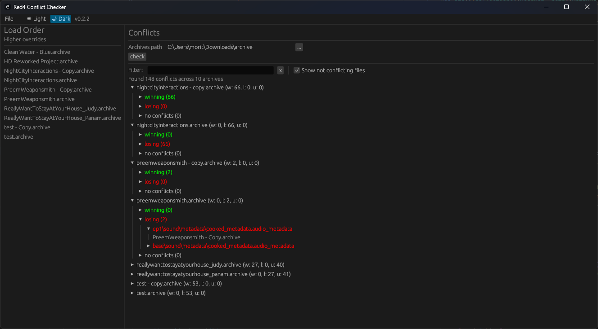
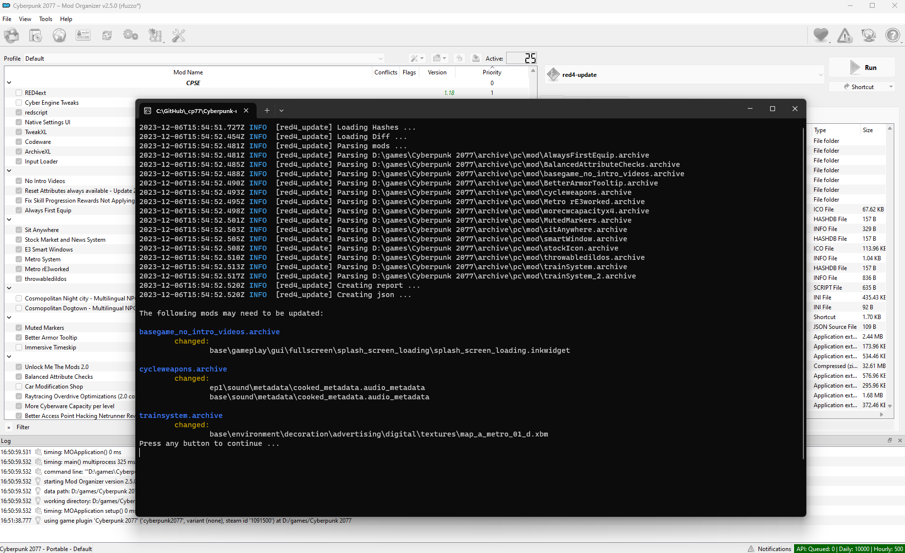

[](https://github.com/rfuzzo/Cyberpunk-utility/actions/workflows/rust.yml)

# Cyberpunk-utility

Some utility tools for Cyberpunk 2077 modding.

## RED4-Conflicts

> Nexus Mods link: https://www.nexusmods.com/cyberpunk2077/mods/11126

A conflict-checker app for Cyberpunk 2077 archives.

### Usage
- download and extract
- run `red4-conflicts.exe` and specify a folder with archives to check

### Screenshots


## RED4-Update

A commandline tool to check if a mod needs an update after a game patch

### Usage
- download and extract
- run `red4-update.exe` and specify a folder with archives to check (or run it from within that folder)

```cmd
Usage: red4-update.exe check [PATH]

Arguments:
  [PATH]  Path to a folder with archives to check

Options:
  -h, --help  Print help
```

### Screenshots


## Cyberpunk-Tweak Util
A small app to display various tweak-related info.

### Usage
- download and extract
- run `red4-tweak_browser.exe` and 
- fill in the path to the REDmod tweak sources when prompted (e.g. `D:\games\Cyberpunk 2077\tools\redmod\tweaks`) 
- hit "Generate" when prompted

### Screenshots


## Tweak-Doxygen

A small rust utility to convert and strip tweak records (<https://github.com/CDPR-Modding-Documentation/Cyberpunk-Tweaks>) to a c# class hierarchy for use with doxygen: <https://cdpr-modding-documentation.github.io/Cyberpunk-Tweaks/>

### Usage
```cmd
tweakdox <SOURCE> <OUT>
```
