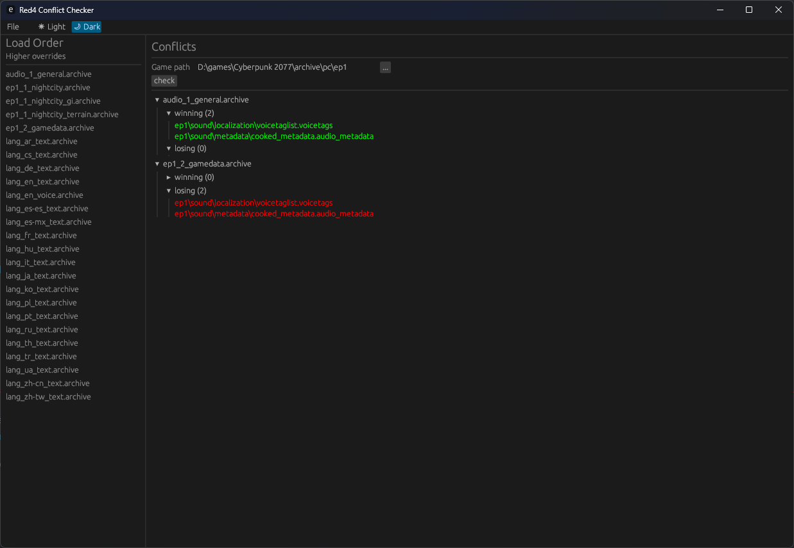

# Cyberpunk-utility

Some utility tools for Cyberpunk 2077 modding.

## Tweak-Doxygen

A small rust utility to convert and strip tweak records (<https://github.com/CDPR-Modding-Documentation/Cyberpunk-Tweaks>) to a c# class hierarchy for use with doxygen: <https://cdpr-modding-documentation.github.io/Cyberpunk-Tweaks/>

```cmd
tweakdox <SOURCE> <OUT>
```

## RED4-Conflicts

A conflict-checker app for Cyberpunk 2077 archives.

